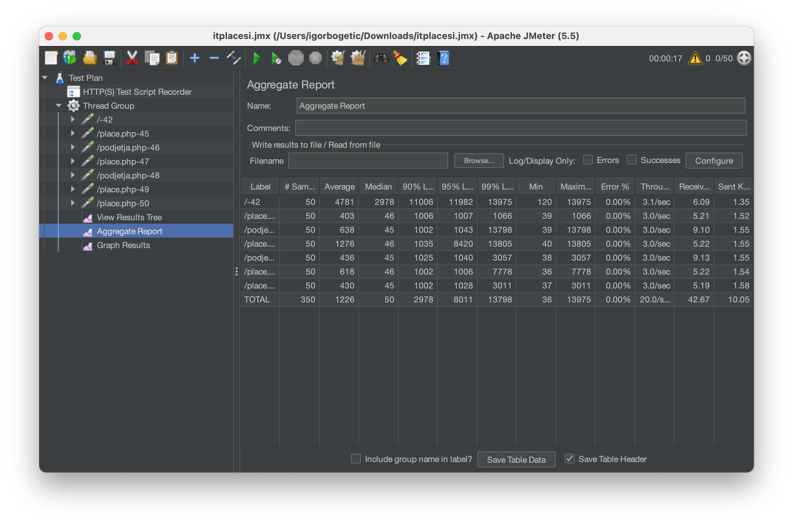
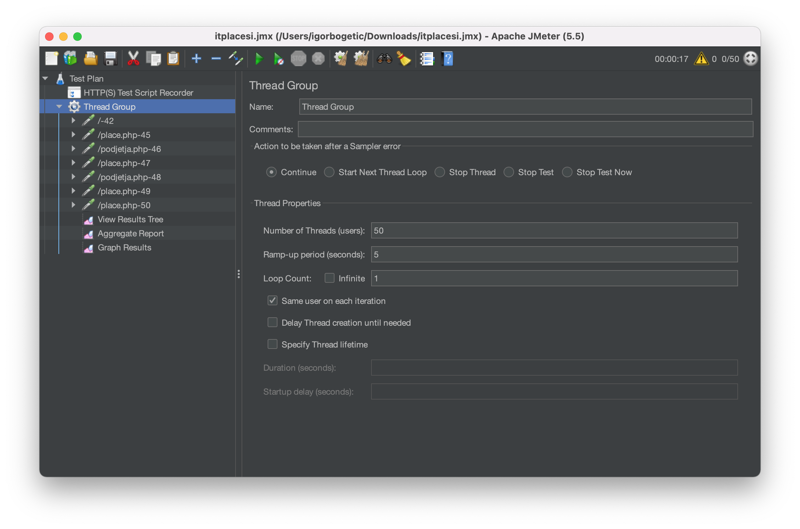
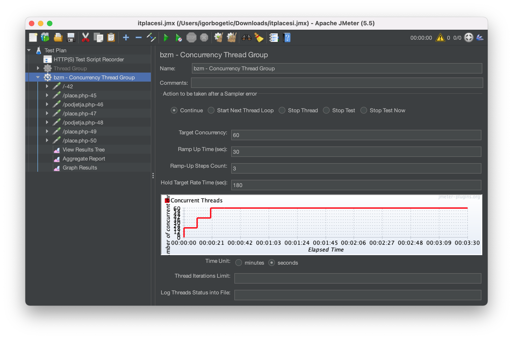
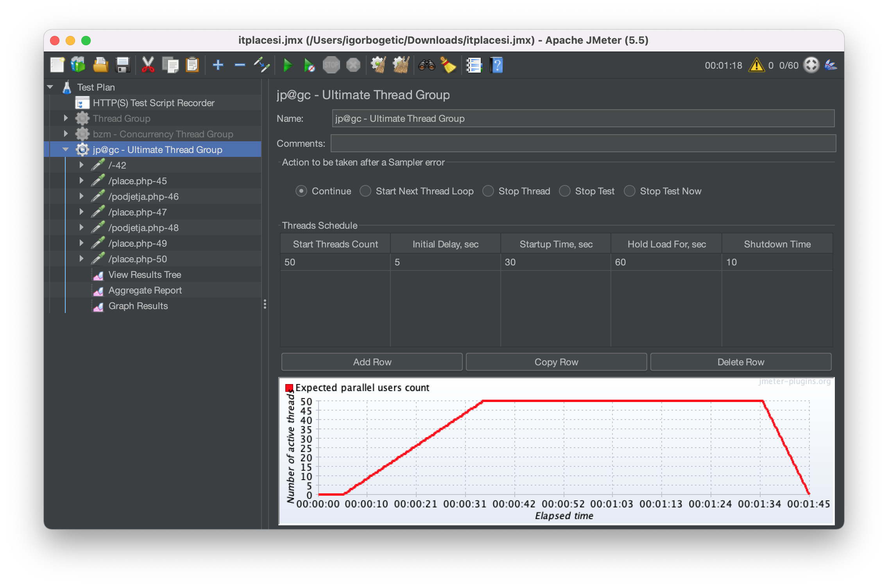
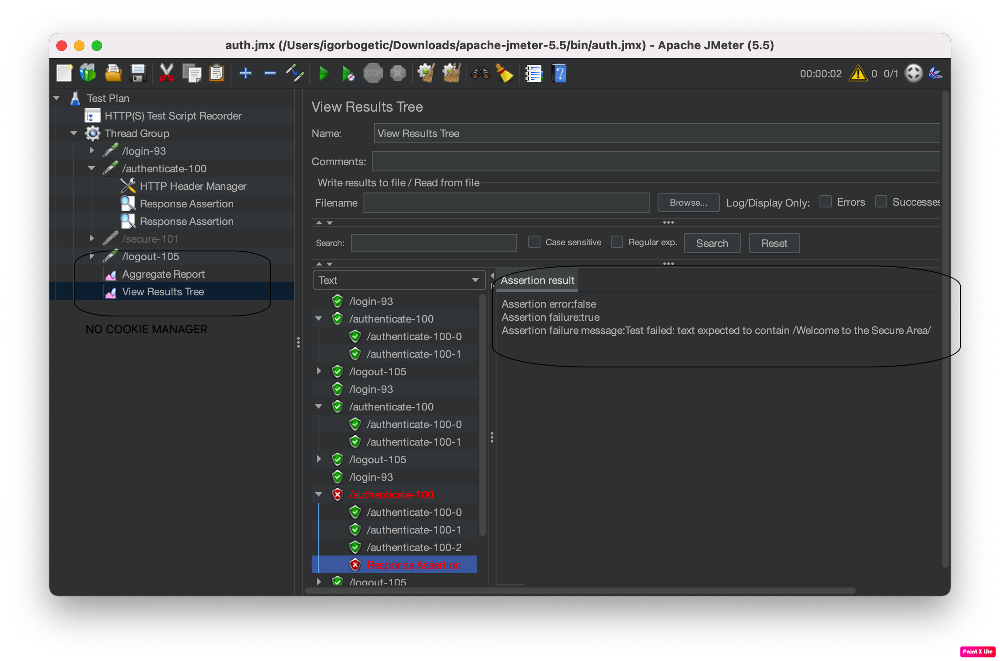
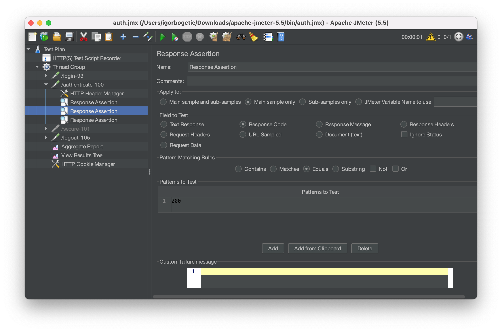
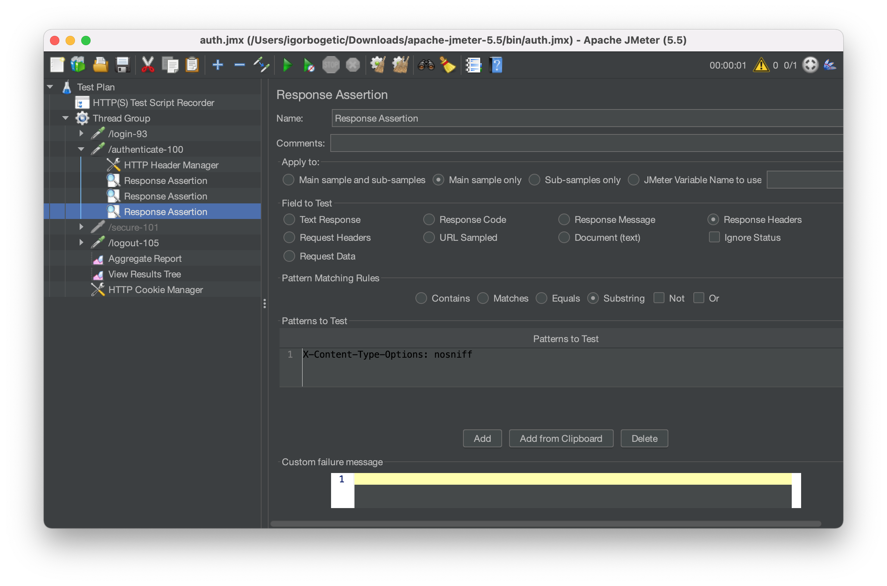

I was learning mainly from [Rahul Shetty's Udemy course](https://www.udemy.com/course/learn-jmeter-from-scratch-performance-load-testing-tool/). Sometimes I used different apps/sites for exercise than those in the course.

# Screenshots

